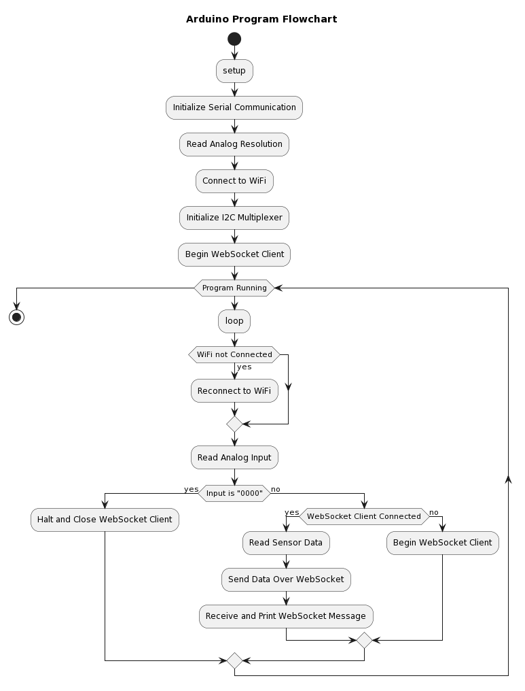

# Arduino WebSocket Client

## Information

- **Board Used**: Arduino MKR WiFi 1010
- **Color Sensor**: Gravity TCS3430 Tristimulus Color Sensor
- **I2C Multiplexer**: Gravity Digital 1-to-8 I2C Multiplexer
- **IDE**: Arduino IDE 2.2.1
- **WiFi**: Usable WiFi

## File Structure

- `RGBSensorClient.ino`: Main program file.

- `Config.h`: Contains configuration and constant values.

- `Arduino_secrets.h`: Stores credential information, especially for Arduino Cloud synchronization.

## Version Control and Remote Repository

- **Version**: 1.0.1

- **GitHub**: https://github.com/ronan583/RgbsensorArduinoClient

- **Recommendation**: Use Arduino Cloud for quick sync across multiple development machines.

## How to Start

### Pre-programmed Devices

Simply connect the Arduino to a powersource, the device will start operating based on the pre-loaded code.

### Programming Device

1. **VERY IMPORTANT**: 

    In ArduinoHttpClient.h -> WebSocketClient.h, set the buffer iTxBuffer size as follows:

    ```c
    uint8_t iTxBuffer[4096]
    ```

    otherwise it will result incomplete or failed message transmissions.

2. **Power**: USB is usually sufficient. Use a high-quality USB cable. A 5V1A power supply guarantees adequate power provision.

3. Comment in the code to set the correct IP, port, WiFi ID, and password.

4. Upload the code to Arduino.

### Pin Configuration

1. Use A0 to A3 as Analog-to-Digital Converter (ADC) Inputs:

2. Connect the multiplexer to the 5V, GND (Ground), SCL (Serial Clock Line), and SDA (Serial Data Line) for stable operation and communication.

3. Color Sensor Integration: The microcontroller and server software are currently configured to support up to four color sensors. It is recommended to use ports 0 to 3 on the multiplexer.

## Features flow



## Data transmission format

JSON structure example:

```json
{
  "Sens": [
    { "id": 0, "d": { "X": 1521, "Y": 1406, "Z": 206, "I1": 190, "I2": 79 } },
    { "id": 1, "d": { "X": 48, "Y": 12, "Z": 6, "I1": 1, "I2": 0 } },
    { "id": 2, "d": null },
    { "id": 3, "d": { "X": 80, "Y": 64, "Z": 20, "I1": 8, "I2": 6 } },
    { "id": 4, "d": null },
    { "id": 5, "d": null },
    { "id": 6, "d": null },
    { "id": 7, "d": null }
  ],
  "adc": "1110",
  "A0": "3810",
  "A1": "3325",
  "A2": "2574",
  "A3": "1872",
  "ssId": "linksys"
}
```

1. d is assigned null when the port is inactive.
2. A0 to A3 represent the voltage values (not actual voltage) from the analog inputs.
3. ssId is for matching purposes and is not currently used.

## References

[Arduino MKR WiFi 1010](https://docs.arduino.cc/hardware/mkr-wifi-1010)

[DFRobot Graivty: TCS3430 Tristimulus Color Sensor](https://wiki.dfrobot.com/Gravity_TCS3430_Tristimulus_Color_Sensor_SKU_SEN0404)

[DFRobot Gravity: I2C Multiplexer](https://wiki.dfrobot.com/Gravity__Digital_1-to-8_I2C_Multiplexer_SKU_DFR0576)

[WiFiNINA Library](https://github.com/arduino-libraries/WiFiNINA)

[ArduinoHttpClient Library](https://github.com/arduino-libraries/ArduinoHttpClient)

[DFRobot_I2C_Multiplexer Library](https://github.com/DFRobot/DFRobot_I2C_Multiplexer)

[DFRobot_TCS3430 Library](https://github.com/DFRobot/DFRobot_TCS3430)
